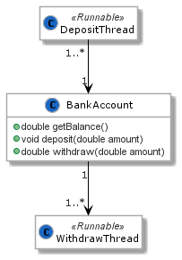
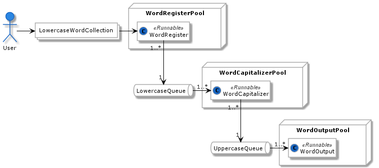

# [Paradigmas de Programação 2020/2021](https://elearning.ual.pt/course/view.php?id=1946), [UAL](https://autonoma.pt/)

## Laboratório 3: Programação concorrente

Este laboratório propõe exercícios focados em programação concorrente.

### Contexto
Continua a exposição ao mecanismo de suporte à concorrência em Java, considerando agora as estratégias de sincronização de acesso a memória entre objetos `Runnable` concorrentes.

### Documentação JDK 11 relevante
- [`java.lang.Thread`](https://docs.oracle.com/en/java/javase/11/docs/api/java.base/java/lang/Thread.html)
- [`java.util.Random`](https://docs.oracle.com/en/java/javase/11/docs/api/java.base/java/util/Random.html)
- [`java.util.Timer`](https://docs.oracle.com/en/java/javase/11/docs/api/java.base/java/util/Timer.html)
- [`java.util.TimerTask`](https://docs.oracle.com/en/java/javase/11/docs/api/java.base/java/util/TimerTask.html)
- [`synchronized`](https://docs.oracle.com/javase/tutorial/essential/concurrency/syncmeth.html)
- [`java.util.concurrent.Lock`](https://docs.oracle.com/en/java/javase/11/docs/api/java.base/java/util/concurrent/locks/Lock.html)
- [`java.util.Condition`](https://docs.oracle.com/en/java/javase/11/docs/api/java.base/java/util/concurrent/locks/Condition.html)
- [`java.util.concurrent.Executors`](https://docs.oracle.com/en/java/javase/11/docs/api/java.base/java/util/concurrent/Executors.html)

## Tarefas

### Tarefa 1
Construa uma *simulação* de movimentos de conta bancária, com as seguintes caraterísticas:

- *Threads* produtoras (`DepositThread`) que registam depósitos na conta
  - Cada thread deposita montantes entre 1 e 10
  - Entre cada depósito, thread espera entre 1 e 3 segundos
  - Quando ultrapassar os 50 em montante total depositado, a *thread* termina
  - A cada operação, a *thread* regista, em `System.out`, o seu identificador, o montante atual na conta, e o montante depositado
- *Threads* consumidoras (`WithdrawThread`) que registam levantamentos
  - Cada thread levanta montantes entre 5 e 20
  - Entre cada depósito, thread espera entre 2 e 5 segundos
  - Quando ultrapassar os 4 levantamentos, a *thread* termina
  - A cada operação, a *thread* regista, em `System.out`, o seu identificador, o montante atual na conta, o número de levantamentos realizados pela *thread* até ao momento, e o sucesso/insucesso da tentativa atual

A conta bancária tem, inicialmente, montante zero. Quando todas as *threads* terminarem, a aplicação deve mostrar o montante atual.

### Tarefa 2
Construa uma aplicação com o modelo Produtor/Consumidor, com as seguintes caraterísticas:

- *ExecutorService* (`WordRegisterPool`) com produtores (`WordRegister`) que adicionam palavras a uma fila (`LowercaseQueue`)
- *ExecutorService* (`WordCapitalizerPool`) com consumidores/produtores (`WordCapitalizer`) que retiram palavras de `LowercaseQueue`, convertem para maiúscula, e adicionam noutra fila de palavras (`UppercaseQueue`)
- *ExecutorService* (`OutputThreadPool`) com consumidores (`OutputThread`) que retiram palavras de `UppercaseQueue` e as escrevem no terminal

A aplicação deve receber uma lista de palavras com letra minúscula do utilizador, guardar numa estrutura auxiliar, e iniciar o registo na fila `LowerCaseQueue`

Teste a aplicação com 3 *threads* em cada *pool*.
